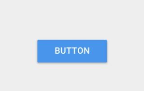
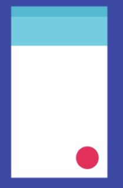

# Botones en Flutter

Flutter sigue las métricas de diseño de Material Design por defecto por lo tanto nos proveerá un kit de botones propios de estas métricas de diseño como: Raised Button, Floating Action Button, Flat Button, etc. Puedes personalizarlos tanto como tu diseño lo exija, esa es la magia de Flutter.

## RaisedButton

Puedes ponerle una elevación personalizada con la propiedad elevation .
Además del color por defecto que también puedes asignar con la propiedad color también puedes definir un color que lo haga brillar mientras pones el dedo sobre él, esto con la propiedad highlightColor

Puedes encontrar la documentación completa aquí (https://docs.flutter.io/flutter/material/RaisedButton-class.html)

## FloatingActionButton

Es ese botón redondo que encuentras flotando en la parte inferior de las interfaces, hoy por hoy puedes ubicarlo en cualquier zona de tu interfaz.

Tenemos dos tamaños el que es por defecto (más grande) y uno pequeño que puedes definirlo poniendo true en la propiedad mini. Un FloatingActionButton tiene una elevación definida por las métricas de diseño de Material Design pero siempre podrás cambiarla con la propiedad highlightElevation. Recuerda que este botón tiene su lugar en la propiedad floatingActionButton del Widget Scaffold.

Esta es la documentación completa (https://docs.flutter.io/flutter/material/FloatingActionButton-class.html)

## FlatButton

Existe también FlatButton que a simple vista puede parecer un enlace, algo que ubicaríamos muy fácilmente en la web.

Puedes cambiarle el color con la propiedad color y modificarlo tanto hasta llevarlo a ser un RaisedButton

Mira todo en la documentación: https://docs.flutter.io/flutter/material/FlatButton-class.html

## IconButton

Viene con el kit de iconos de Material Design y además tiene el comportamiento que vemos en la imagen por defecto.

Aquí encuentras las propiedades de este tipo de botón https://docs.flutter.io/flutter/material/IconButton-class.html