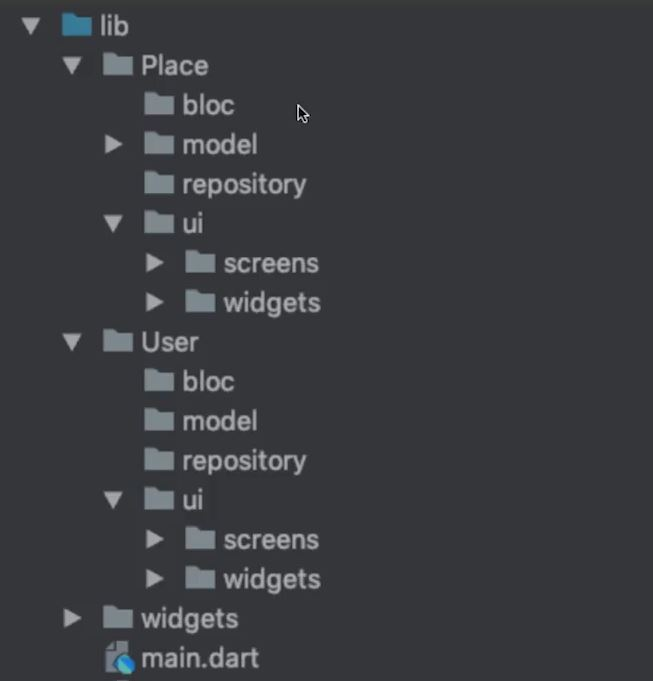

# Tipos de Arquitecturas para Flutter

## Vanilla

En esta arquitectura la lógica y la vista se colocan en el Widget. Su principal beneficio es que es simple y autónoma. Conectado en cualquier parte de tu aplicación, recuperará y renderizará datos.

Por otro lado, escribir widgets de esta manera puede generar caos en el documento de vista de la app, sobre todo cuando la lógica empieza a extenderse a bifurcarse o es más avanzado.

```javascript

Widget _buildInit() {
    return Center(
      child: RaisedButton(
        child: const Text('Load user data'),
        onPressed: () {
          setState(() {
            _isLoading = true;
          });
          widget._repository.getUser().then((user) {
            setState(() {
              _user = user;
              _isLoading = false;
            });
          });
        },
      ),
    );
  }

```

No te recomiendo mucho usar este tipo de Arquitectura pues aunque es fácil de aprender en realidad rómpe con uno de los principios SOLID que deben seguir todas las arquitecturas. Single Responsability la cuál dice que una clase debe tener solo una responsabilidad. En este caso la vista y el controlador son dos responsabilidades que están cayendo en la misma clase.


## Scoped Model

```javascript
Widget _buildInit(UserModel userModel) {
    return Center(
      child: RaisedButton(
        child: const Text('Load user data'),
        onPressed: () {
          userModel.loadUserData();
        },
      ),
    );
}
```
En esta arquitectura cuando un Widget cambia de estado se reconstruye el árbol completo (Toda la pantalla). En realidad esto no es tan conveniente pues lo que quisiéramos que sucediera idealmente es reconstruir solo el widget que está cambiando y no los otros.

Esta arquitectura es buena pues cumple con el Principio de Single Responsability pues separa la lógica del negocio de la UI, pero en general el mantenimiento de este se vuelve complejo por la grande dependencia entre Widgets, debes controlar muchos casos para lograr el efecto que quires dar a tu aplicación.


## Arquitectura BLoC en Flutter

BLoC significa Business Logic Components, es un patrón de diseño que separa la lógica de negocio de la interfaz gráfica.

BLoC Pattern:

- View (UI Screen): Contendrá toda la interacción con las vistas; podemos organizarla en screens y widgets.

- BLoC: La capa de negocio estará contenida aquí, por ejemplo: registrarse a la aplicación, hacer login o hacer logout; toda vista que tenga una lógica de negocio deberá tener un componente BLoC.

- Repository: Aquí se concentran las clases que se conectan con una fuente de datos; API, Endpoints, DataBase, etc.

- Data / Model: Son nuestros modelos, los cuales nos ayudan a manejar los datos; PODO Plain Old Dart Object


## BLoC + Clean Architecture en Flutter

como hacer que el proyecto hable por sí solo de cómo funciona usando BLoC + Clean Architecture.

Debemos recordar que nuestro proyecto debe ser legible para nuestros compañeros de trabajo y cualquier persona que lo lea; un plus a esto el proyecto debe ser entendible por sí solo.

Clena architecture sugiere que se expongan las entidades y cada una por si sola tenga implenetada la arquitectura BLoC.




