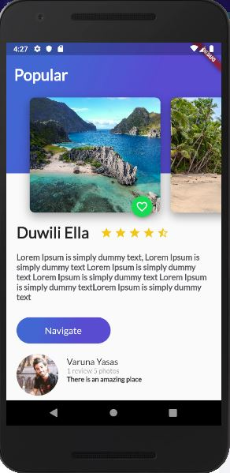

# Flutter Guide

- Esta es una pequeña introducción a flutter, en donde encontraras
conceptos basicos de como crear aplicaciones cross-platform con esta
herramienta

- Tambien cuenta con una pequeña aplicacion de ejemplo llamada travel_app
donde podras ver la implementación de los controles basicos de flutter

------------------------------------
- This is a small introduction to flutter, where you will find
basic concepts of how to create cross-platform applications with this
tool

- It also has a small sample application called travel_app
where you can see the implementation of the basic flutter controls

 

## Getting Started
This project is a starting point for a Flutter application.

A few resources to get you started if this is your first Flutter project:

- <a href="https://flutter.dev/docs/get-started/codelab">Lab: Write your first Flutter app</a>
- <a href="https://flutter.dev/docs/cookbook">Cookbook: Useful Flutter samples</a>

For help getting started with Flutter, view our <a href="https://flutter.dev/docs">online documentation</a>, which offers tutorials, samples, guidance on mobile development, and a full API reference.